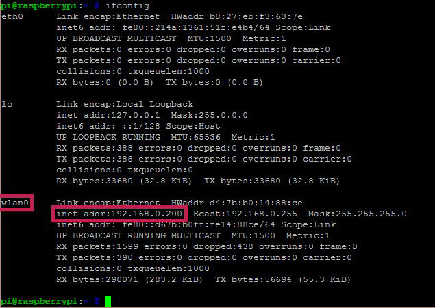
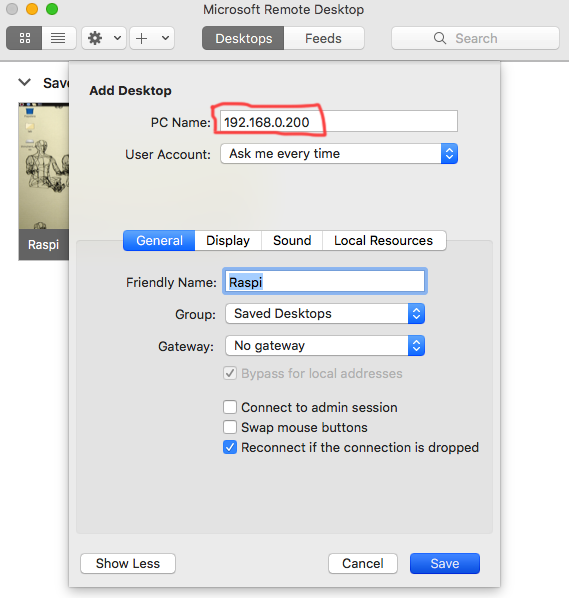
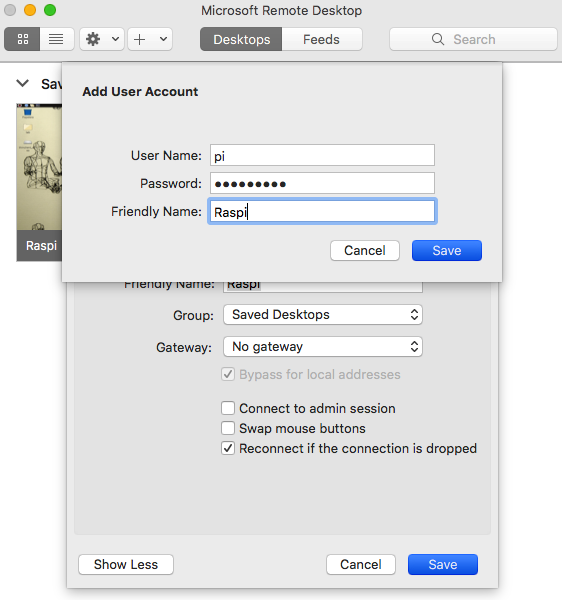

# Conexión remota - usar computador como monitor, teclado y mouse de la Pi

Para poder controlar la Pi con un computador externo debemos instalar una serie de programas tanto en a Pi como en nuestro computador. 

**Es importante que ambos estén conectados al mismo wifi.**

## Configuración en la Raspberry Pi

En el terminal, instalamos el paquete de conexión remota `xrdp`

```bash
sudo apt-get install xrdp
```

Al terminar la instalación usamos el siguiente comando en el terminal para saber la dirección IP que esta usando la Pi en nuestra red wifi. 

```bash
ifconfig
```

En el resultado podemos encontrar la IP hacia el final del bloque de texto, el numero que necesitamos saber es `inet addr:` 192.168.0.xxx:



Con la dirección IP de la Pi podemos conectarnos desde otro computador (Pc, Mac, etc), en el ejemplo anterior la IP es: **192.168.0.200** este numero es distinto en diferentes redes wifi.

## Configuración en computador personal

Cualquier programa "remote desktop" sirve, por ejemplo, vamos a usar "Microsoft Remote Desktop":

["Microsoft Remote Desktop" para Mac](https://itunes.apple.com/us/app/microsoft-remote-desktop-10/id1295203466?mt=12)

["Microsoft Remote Desktop" para PC](https://www.microsoft.com/en-us/p/microsoft-remote-desktop/9wzdncrfj3ps?activetab=pivot:overviewtab)


### "PC Name" = dirección IP en la Pi

En Remote Desktop le damos agregar nuevo computador y en el campo **PC Name** usamos la dirección IP de la Pi que obtuvimos antes, en este ejemplo sería 192.168.0.200



### User Account

En nuestro caso les dejamos el usuario y contraseña predeterminadas a las Pi cuando estábamos instalando el sistema operativo.

User Name: **pi**
Password: **raspberry**
Friendly Name: *Puede ser cualquier nombre, en este caso lo voy a nombrar Raspi*



Eso es todo, guardamos esta configuración y ya podemos conectarnos a la Pi desde nuestro computador. 

